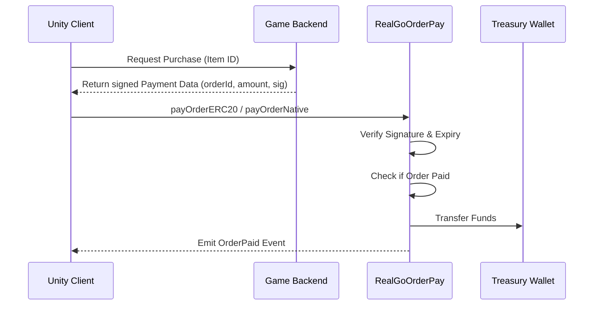

# 📦 RealGoOrderPay - Web3 Game Payment Gateway

A production-ready, secure, and gas-optimized smart contract gateway designed for Web3 games. It handles on-chain order payments using both **Native Tokens** (ETH/BNB/MATIC) and **Whitelisted ERC20** tokens with a backend-signed verification system.

---

## ✨ Key Features

-   **Signature-Based Payments**: Uses `ECDSA` to verify signatures from a trusted backend `submitter`. This ensures that only authorized orders with specific prices can be executed on-chain.
-   **Multi-Token Support**: Dynamic whitelist for ERC20 tokens and toggleable Native currency support.
-   **Security First**:
    -   **Reentrancy Protection**: Integrated `ReentrancyGuard` to prevent recursive call attacks.
    -   **Idempotency**: Prevents double-spending by tracking `orderId` + `paymentId` hashes.
    -   **Replay Protection**: Includes `chainId` in the signature hash to prevent cross-chain replay attacks.
-   **Direct Settlement**: Funds are automatically routed to a cold `treasury` wallet, minimizing contract-held funds.

---

## 🛠 Technical Architecture



---

## 🚀 Smart Contract API

### User Functions
- `payOrderERC20(string orderId, string paymentId, address token, uint256 amount, bytes signature)`: Pay via approved ERC20.
- `payOrderNative(string orderId, string paymentId, bytes signature)`: Pay via Native network token.
- `isPaid(string orderId, string paymentId)`: View function to verify payment status.

### Admin Functions
- `addToken / removeToken`: Manage whitelisted payment assets.
- `setSubmitter`: Update the authorized backend signer address.
- `rescueToken`: Admin emergency recovery of accidentally sent tokens.

---

## 🎮 Unity Integration (C#)

This repository includes a C# wrapper for **Nethereum** to bridge your Unity game with the contract.

1. Import **Nethereum** library into your project.
2. Initialize the service with your provider:
      
```csharp
var web3 = new Web3("https://bsc-dataseed.binance.org/");
var paymentService = new RealGoPaymentService(web3, "0xContract...");

// Call payment (data usually comes from your game server)
string txHash = await paymentService.PayWithERC20(orderId, payId, usdtAddr, 10.5m, 6, serverSig);
```

```csharp
// Example: Calling payOrderERC20 in Unity
public async Task ExecutePayment(string orderId, string payId, string token, string amountStr, string sigHex) {
    var payFunction = new PayOrderERC20Function() {
        OrderId = orderId,
        PaymentId = payId,
        Token = token,
        Amount = Web3.Convert.ToWei(amountStr),
        Signature = sigHex.HexToByteArray()
    };

    var handler = web3.Eth.GetContractTransactionHandler<PayOrderERC20Function>();
    var receipt = await handler.SendRequestAndWaitForReceiptAsync(contractAddress, payFunction);
    Debug.Log($"Payment Hash: {receipt.TransactionHash}");
}
```
---
## 🛠 Backend Integration (Node.js)

To ensure secure payments, the backend `submitter` must sign the order data. Below is the implementation using `ethers.js`:

```javascript
const messageHash = ethers.solidityPackedKeccak256(
    ["uint256", "string", "string", "address", "uint256"],
    [chainId, orderId, paymentId, token, amount]
);
const signature = await wallet.signMessage(ethers.getBytes(messageHash));
```
*Full signing script available in `/server/sign.js`.*

---
## 🛡 Security Audit Highlights

- **SafeERC20**: Uses OpenZeppelin's `SafeERC20` to handle tokens that don't return booleans (e.g., USDT on some chains).
- **Access Control**: Critical functions are protected by `onlyOwner`.
- **Integrity**: `keccak256(abi.encodePacked(...))` ensures that any tampering with the `amount` or `orderId` in the frontend will result in a signature mismatch.

---

## 📦 Installation & Setup

1. **Deploy**:
   ```bash
   # Using Hardhat
   npx hardhat run scripts/deploy.js --network <your-network>
   ```
2. **Configure**:
   - Call `addToken()` to whitelist USDT/USDC.
   - Call `setSubmitter()` to link your backend wallet.

## 🤝 Contribution
Contributions are welcome! If you find a bug or have a feature request, please open an issue.
